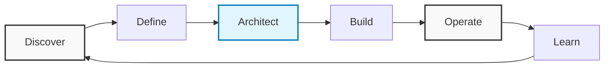

# Olá, sou o Deivid 👋

> **Technical Product Manager** focado em estruturar produtos que resolvem problemas reais. Minha atuação conecta estratégia de negócio, arquitetura técnica e operação, garantindo que a execução esteja sempre alinhada ao valor entregue.

---

## 🚀 Como eu penso produto

Acredito que a tecnologia é o meio para viabilizar soluções, não o fim. Meu ciclo de trabalho reflete essa visão de **Product Discovery contínuo**:

| Etapa | Foco da Atuação |
| :--- | :--- |
| **Discover** | Entender a dor real do usuário e o impacto no negócio antes de falar em solução. |
| **Define** | Traduzir problemas em requisitos claros, escopo viável e regras de negócio. |
| **Architect** | Desenhar a estrutura técnica e de dados para suportar a solução de forma escalável. |
| **Build** | Apoiar o desenvolvimento com clareza técnica, removendo impedimentos. |
| **Operate** | Garantir que o produto funcione na vida real, com logs, monitoramento e suporte. |
| **Learn** | Usar dados da operação para retroalimentar o ciclo e evoluir o produto. |

---

## 🛠 Como eu atuo na prática

Minha responsabilidade vai além de priorizar backlog. Atuo na tradução de complexidade em clareza:

> "Eu organizo problemas complexos em soluções técnicas claras, documentadas e operáveis."

- **Levantamento e Requisitos:** Transformo necessidades de negócio em especificações técnicas detalhadas (funcionais e não funcionais).
- **Arquitetura e Dados:** Apoio na definição de modelos de dados, integrações e fluxos sistêmicos.
- **Governança Técnica:** Garanto que decisões de hoje não virem dívida técnica impagável amanhã.
- **Operação Assistida:** Acompanho o produto em produção para identificar gargalos e oportunidades de automação.

---

## 🏆 Projetos em Destaque

### [AuroraPay – Régua de Cobrança Inteligente](https://github.com/deividnf/AuroraPay_Servicos_Digitais)

Sistema automatizado para envio de faturas e lembretes de cobrança, focado em redução de inadimplência e eficiência operacional.

  

| Característica | Detalhe Técnico |
| :--- | :--- |
| **Envio Automático** | Dispara e-mails baseados em regras temporais (D-5, D0, D+3) de forma autônoma. |
| **Idempotência** | Garante segurança no processo, impedindo envios duplicados para o mesmo cliente no mesmo dia. |
| **Templates HTML** | Layouts profissionais e dinâmicos para comunicação clara com o cliente final. |
| **Excel V2** | Leitura robusta de dados em múltiplas abas (Clientes, Faturas, Itens). |
| **Modo de Teste** | Permite simulação segura de envios sem impactar a base real de clientes. |

---

## 📄 Artefatos que eu produzo

Acredito que documentação é parte da entrega de valor. Meus entregáveis incluem:

| Artefato | Descrição |
| :--- | :--- |
| **PRDs** | Especificações claras (Product Requirement Documents) para engenharia e QA. |
| **Diagramas C4 / UML** | Desenhos de arquitetura, fluxo de dados e componentes. |
| **BPMN** | Mapeamento visual de jornadas de usuário e processos sistêmicos. |
| **POPs** | Procedimentos Operacionais Padrão para sustentação do produto. |
| **Automações** | Scripts em Python/Low-code para otimizar processos internos. |

---

## 💻 Stack Tecnológica

Utilizo a tecnologia para entender, arquitetar e validar soluções:

| Categoria | Tecnologias |
| :--- | :--- |
| **Linguagens** |    |
| **APIs** | REST, Postman, Webhooks, Design de Contratos. |
| **Dados** | Power BI, Modelagem de Dados, SQL Analytics. |
| **Produto** | Jira, Figma, Miro, Notion. |
| **Automação** | Power Automate, Scripts Python, RPA. |

---

## 📫 Contato

Vamos conversar sobre produto e tecnologia?

