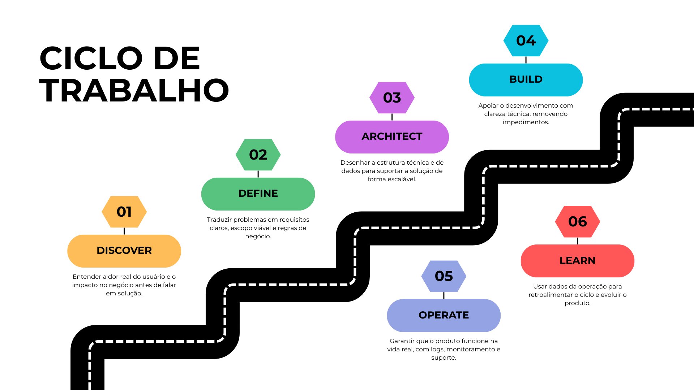

# Olá, sou o Deivid 👋

**Technical Product Manager** focado em estruturar produtos que resolvem problemas reais. Minha atuação conecta estratégia de negócio, arquitetura técnica e operação, garantindo que a execução esteja sempre alinhada ao valor entregue.

---

## 🚀 Como eu penso produto

Acredito que a tecnologia é o meio para viabilizar soluções, não o fim. Meu ciclo de trabalho reflete essa visão de **Product Discovery contínuo**:

<table width="100%">
  <thead>
    <tr>
      <th>Etapa</th>
      <th>Foco da Atuação</th>
    </tr>
  </thead>
  <tbody>
    <tr>
      <td><strong>🔍 Discover</strong></td>
      <td>Entender a dor real do usuário e o impacto no negócio antes de falar em solução.</td>
    </tr>
    <tr>
      <td><strong>📝 Define</strong></td>
      <td>Traduzir problemas em requisitos claros, escopo viável e regras de negócio.</td>
    </tr>
    <tr>
      <td><strong>🏗️ Architect</strong></td>
      <td>Desenhar a estrutura técnica e de dados para suportar a solução de forma escalável.</td>
    </tr>
    <tr>
      <td><strong>⚙️ Build</strong></td>
      <td>Apoiar o desenvolvimento com clareza técnica, removendo impedimentos.</td>
    </tr>
    <tr>
      <td><strong>🚀 Operate</strong></td>
      <td>Garantir que o produto funcione na vida real, com logs, monitoramento e suporte.</td>
    </tr>
    <tr>
      <td><strong>📈 Learn</strong></td>
      <td>Usar dados da operação para retroalimentar o ciclo e evoluir o produto.</td>
    </tr>
  </tbody>
</table>

---

## 🛠 Como eu atuo na prática

Minha responsabilidade vai além de priorizar backlog. Atuo na tradução de complexidade em clareza:

> "Eu organizo problemas complexos em soluções técnicas claras, documentadas e operáveis."

- **Levantamento e Requisitos:** Transformo necessidades de negócio em especificações técnicas detalhadas (funcionais e não funcionais).
- **Arquitetura e Dados:** Apoio na definição de modelos de dados, integrações e fluxos sistêmicos.
- **Governança Técnica:** Garanto que decisões de hoje não virem dívida técnica impagável amanhã.
- **Operação Assistida:** Acompanho o produto em produção para identificar gargalos e oportunidades de automação.

---

## 🏆 Projetos em Destaque

### [AuroraPay – Régua de Cobrança Inteligente](https://github.com/deividnf/AuroraPay_Servicos_Digitais)

Sistema automatizado para envio de faturas e lembretes de cobrança, focado em redução de inadimplência e eficiência operacional.

 
 

<table width="100%">
  <thead>
    <tr>
      <th>Característica</th>
      <th>Detalhe Técnico</th>
    </tr>
  </thead>
  <tbody>
    <tr>
      <td><strong>📧 Envio Automático</strong></td>
      <td>Dispara e-mails baseados em regras temporais (D-5, D0, D+3) de forma autônoma.</td>
    </tr>
    <tr>
      <td><strong>🛡️ Idempotência</strong></td>
      <td>Garante segurança no processo, impedindo envios duplicados para o mesmo cliente no mesmo dia.</td>
    </tr>
    <tr>
      <td><strong>🎨 Templates HTML</strong></td>
      <td>Layouts profissionais e dinâmicos para comunicação clara com o cliente final.</td>
    </tr>
    <tr>
      <td><strong>📊 Excel V2</strong></td>
      <td>Leitura robusta de dados em múltiplas abas (Clientes, Faturas, Itens).</td>
    </tr>
    <tr>
      <td><strong>🧪 Modo de Teste</strong></td>
      <td>Permite simulação segura de envios sem impactar a base real de clientes.</td>
    </tr>
  </tbody>
</table>

---

## 📄 Artefatos que eu produzo

Acredito que documentação é parte da entrega de valor. Meus entregáveis incluem:

<table width="100%">
  <thead>
    <tr>
      <th>Artefato</th>
      <th>Descrição</th>
    </tr>
  </thead>
  <tbody>
    <tr>
      <td><strong>📋 PRDs</strong></td>
      <td>Especificações claras (Product Requirement Documents) para engenharia e QA.</td>
    </tr>
    <tr>
      <td><strong>🏗️ C4 / UML</strong></td>
      <td>Desenhos de arquitetura, fluxo de dados e componentes.</td>
    </tr>
    <tr>
      <td><strong>🔄 BPMN</strong></td>
      <td>Mapeamento visual de jornadas de usuário e processos sistêmicos.</td>
    </tr>
    <tr>
      <td><strong>📚 POPs</strong></td>
      <td>Procedimentos Operacionais Padrão para sustentação do produto.</td>
    </tr>
    <tr>
      <td><strong>🤖 Automações</strong></td>
      <td>Scripts em Python/Low-code para otimizar processos internos.</td>
    </tr>
  </tbody>
</table>

---

## 💻 Stack Tecnológica

Utilizo a tecnologia para entender, arquitetar e validar soluções:

<table width="100%">
  <thead>
    <tr>
      <th>Categoria</th>
      <th>Tecnologias</th>
    </tr>
  </thead>
  <tbody>
    <tr>
      <td><strong>Linguagens</strong></td>
      <td>
        
        
        
      </td>
    </tr>
    <tr>
      <td><strong>APIs</strong></td>
      <td>
        
        
        
      </td>
    </tr>
    <tr>
      <td><strong>Dados</strong></td>
      <td>
        
        
      </td>
    </tr>
    <tr>
      <td><strong>Produto</strong></td>
      <td>
        
        
        
        
      </td>
    </tr>
    <tr>
      <td><strong>Automação</strong></td>
      <td>
        
        
      </td>
    </tr>
  </tbody>
</table>

---

## 📫 Contato

Vamos conversar sobre produto e tecnologia?

  
  
  

